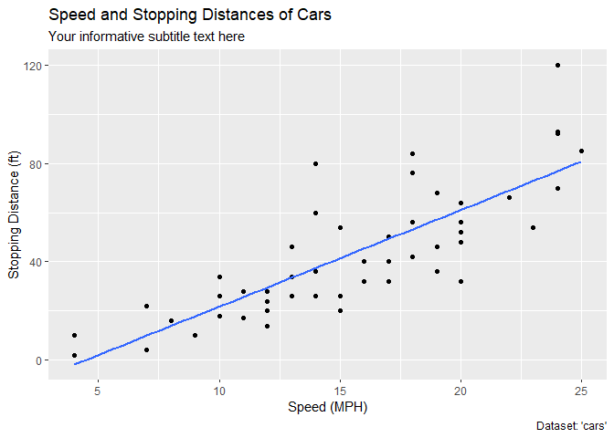
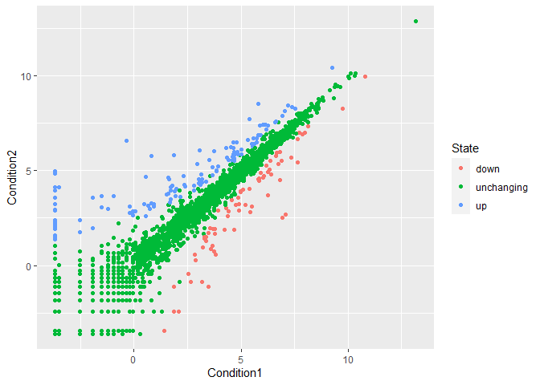
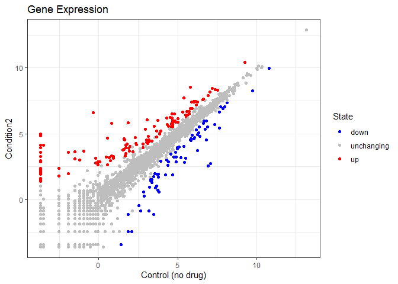

Class05
================
Joel Kosareff

Install the package ggplot2

``` r
#install.packages("ggplot2")
```

Any time I want to use this package I need to load it.

``` r
library(ggplot2)
```

``` r
View(cars)
```

A quick base R plot - not in ggplot2

``` r
plot(cars)
```


Our First ggplot. We need data + aes + geoms

``` r
ggplot(data = cars) + aes(x = speed, y = dist) + geom_point()
```


``` r
p <- ggplot(data = cars) + aes(x = speed, y = dist) + geom_point()
```

Add a line geometry with line_geom()

``` r
p + geom_line()
```


Add a trend line close to the data

``` r
p + geom_smooth()
```

    `geom_smooth()` using method = 'loess' and formula = 'y ~ x'


``` r
p + geom_smooth(method="lm", se = FALSE)
```

    `geom_smooth()` using formula = 'y ~ x'


``` r
p + labs(title="Speed and Stopping Distances of Cars", x = "Speed (MPH)", y = "Stopping Distance (ft)", subtitle = "Your informative subtitle text here", caption = "Dataset: 'cars'") + geom_smooth(method="lm", se = FALSE)
```

    `geom_smooth()` using formula = 'y ~ x'



Read in our drug expression data

``` r
url <- "https://bioboot.github.io/bimm143_S20/class-material/up_down_expression.txt"
genes <- read.delim(url)
head(genes)
```

            Gene Condition1 Condition2      State
    1      A4GNT -3.6808610 -3.4401355 unchanging
    2       AAAS  4.5479580  4.3864126 unchanging
    3      AASDH  3.7190695  3.4787276 unchanging
    4       AATF  5.0784720  5.0151916 unchanging
    5       AATK  0.4711421  0.5598642 unchanging
    6 AB015752.4 -3.6808610 -3.5921390 unchanging

Q. How many genes are in this dataset?

``` r
nrow(genes)
```

    [1] 5196

``` r
ncol(genes)
```

    [1] 4

How many Up regulated genes are there?

``` r
table(genes$State)
```


          down unchanging         up 
            72       4997        127 

What fraction of genes are up regulated?

``` r
round(table(genes$State)/nrow(genes) * 100, 2)
```


          down unchanging         up 
          1.39      96.17       2.44 

Lets make a first plot attempt

``` r
g <- ggplot(data = genes) + aes(x = Condition1, y = Condition2, col = State) +   geom_point()
g
```



Add some color

``` r
g + scale_color_manual(values=c("blue","gray","red")) + labs(title = "Gene Expression", x = "Control (no drug)") + theme_bw()
```


