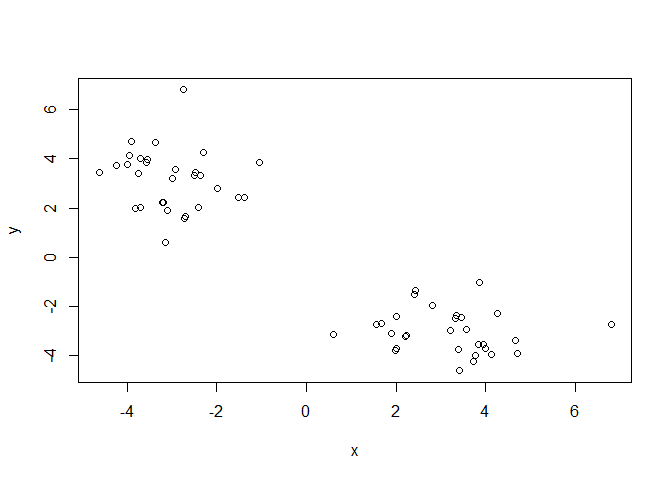
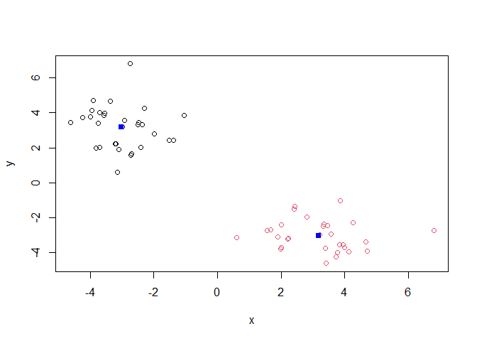
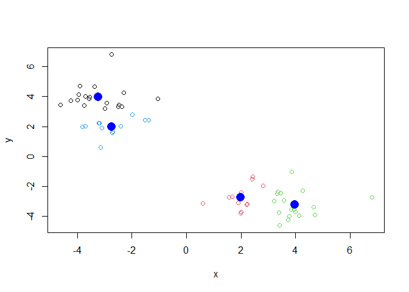
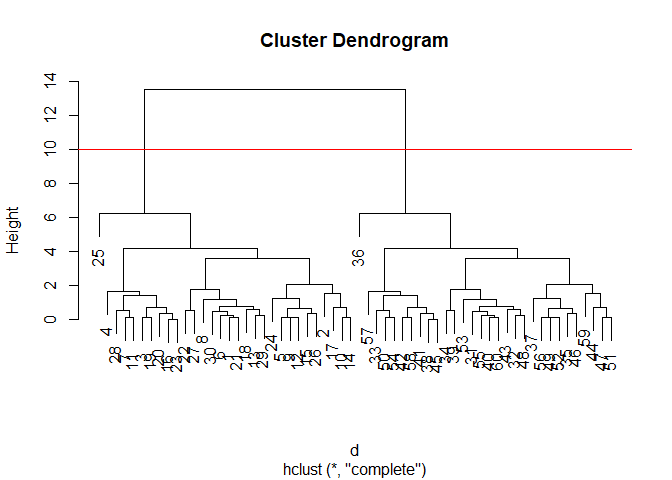
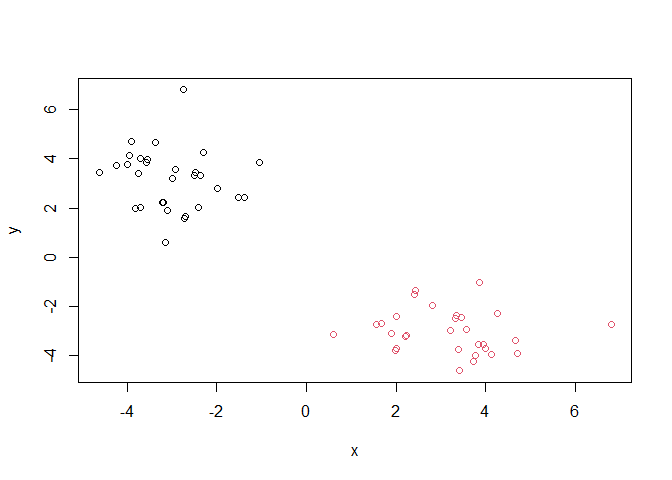
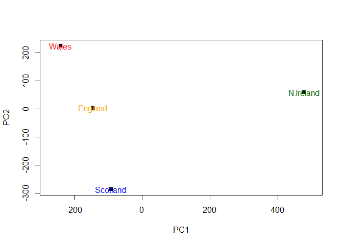

Class 7: Machine Learning 1
================
Joel Kosareff

In this class we will explore clustering and dimensionality reduction
methods.

## K-means

Make up some input data where we know what the answer should be.

``` r
tmp <- c(rnorm(30, -3), rnorm(30, 3))
x <- cbind(x = tmp, y = rev(tmp))
head(x)
```

                 x         y
    [1,] -3.553364 3.9619669
    [2,] -1.048968 3.8686039
    [3,] -3.704787 2.0139855
    [4,] -3.141898 0.5964023
    [5,] -2.363322 3.3415906
    [6,] -3.711429 4.0040850

Quick plot of x to see the two groups at -3,3 and +3,-3

``` r
plot(x)
```



Use the `kmeans()` function setting k to 2 and nstart=20

``` r
km <- kmeans(x, centers = 2, nstart = 20)
km
```

    K-means clustering with 2 clusters of sizes 30, 30

    Cluster means:
              x         y
    1 -3.031370  3.176968
    2  3.176968 -3.031370

    Clustering vector:
     [1] 1 1 1 1 1 1 1 1 1 1 1 1 1 1 1 1 1 1 1 1 1 1 1 1 1 1 1 1 1 1 2 2 2 2 2 2 2 2
    [39] 2 2 2 2 2 2 2 2 2 2 2 2 2 2 2 2 2 2 2 2 2 2

    Within cluster sum of squares by cluster:
    [1] 65.16861 65.16861
     (between_SS / total_SS =  89.9 %)

    Available components:

    [1] "cluster"      "centers"      "totss"        "withinss"     "tot.withinss"
    [6] "betweenss"    "size"         "iter"         "ifault"      

Inspect the results

> Q. How many points are in each cluster?

``` r
km$size
```

    [1] 30 30

> Q. What ‘component’ of your result object details Cluster
> Assignment/membership? Cluster Center

``` r
km$cluster
```

     [1] 1 1 1 1 1 1 1 1 1 1 1 1 1 1 1 1 1 1 1 1 1 1 1 1 1 1 1 1 1 1 2 2 2 2 2 2 2 2
    [39] 2 2 2 2 2 2 2 2 2 2 2 2 2 2 2 2 2 2 2 2 2 2

``` r
km$centers
```

              x         y
    1 -3.031370  3.176968
    2  3.176968 -3.031370

> Q. Plot x colored by the kmeans cluster assignment and add cluster
> centers as blue

``` r
plot(x, col=km$cluster)
points(km$centers, col = "blue", pch=15)
```



Play with kmeans and ask for different number of clusters

``` r
km <- kmeans(x, centers = 4, nstart = 20)
plot(x, col=km$cluster)
points(km$centers, col = "blue", pch=16, cex=2)
```



# Hierarchical Clustering

This is another very useful and widely employed clustering method which
has the advantage over kmeans in that it can help reveal the something
of the true grouping in your data.

The `hclust()` function wants a distance matrix as input. We can get
this from the `dist()` function.

``` r
d <- dist(x)
hc <- hclust(d)
hc
```


    Call:
    hclust(d = d)

    Cluster method   : complete 
    Distance         : euclidean 
    Number of objects: 60 

There is a plot method for hclust results

``` r
plot(hc)
abline(h = 10, col ="red")
```



To get my cluster membership vector I need to “cut” my tree to yield
sub-trees or branches with all the members of a given cluster residing
on the same cut branch. The function to do this is `cutree()`

``` r
grps <- cutree(hc, h=10)
grps
```

     [1] 1 1 1 1 1 1 1 1 1 1 1 1 1 1 1 1 1 1 1 1 1 1 1 1 1 1 1 1 1 1 2 2 2 2 2 2 2 2
    [39] 2 2 2 2 2 2 2 2 2 2 2 2 2 2 2 2 2 2 2 2 2 2

``` r
plot(x, col=grps)
```



We can run `cutree()` with a number of clusters instead of height with
the `k=` argument. This cuts the tree at the number of clusters we want
instead of manually deciding the height.

``` r
cutree(hc, k = 4)
```

     [1] 1 1 1 1 1 1 1 1 1 1 1 1 1 1 1 1 1 1 1 1 1 1 1 1 2 1 1 1 1 1 3 3 3 3 3 4 3 3
    [39] 3 3 3 3 3 3 3 3 3 3 3 3 3 3 3 3 3 3 3 3 3 3

# Principal Component Analysis (PCA)

The base R function for PCA is called `prcomp()`

## PCA of UK Food Data

Import the data

``` r
url <- "https://tinyurl.com/UK-foods"
x <- read.csv(url, row.names = 1)
View(x)
```

``` r
dim(x)
```

    [1] 17  4

``` r
barplot(as.matrix(x), beside=F, col=rainbow(nrow(x)))
```


``` r
pairs(x, col=rainbow(10), pch=16)
```


Use the `prcomp()`PCA function

``` r
pca <- prcomp(t(x))
summary(pca)
```

    Importance of components:
                                PC1      PC2      PC3       PC4
    Standard deviation     324.1502 212.7478 73.87622 4.189e-14
    Proportion of Variance   0.6744   0.2905  0.03503 0.000e+00
    Cumulative Proportion    0.6744   0.9650  1.00000 1.000e+00

A “PCA Plot” (a.k.a “Score plot”, PC1vsPC2 plot, etc.)

``` r
plot(pca$x[,1], pca$x[,2], xlab="PC1", ylab="PC2", xlim=c(-270,500), pch = 15)
text(pca$x[,1], pca$x[,2], colnames(x), col=c("orange","red","blue","darkgreen"))
```



``` r
v <- round( pca$sdev^2/sum(pca$sdev^2) * 100 )
v
```

    [1] 67 29  4  0

``` r
z <- summary(pca)
z$importance
```

                                 PC1       PC2      PC3          PC4
    Standard deviation     324.15019 212.74780 73.87622 4.188568e-14
    Proportion of Variance   0.67444   0.29052  0.03503 0.000000e+00
    Cumulative Proportion    0.67444   0.96497  1.00000 1.000000e+00

``` r
barplot(v, xlab="Principal Component", ylab="Percent Variation")
```


``` r
par(mar=c(10, 3, 0.35, 0))
barplot( pca$rotation[,1], las=2 )
```


``` r
par(mar=c(10, 3, 0.35, 0))
barplot( pca$rotation[,2], las=2 )
```


``` r
biplot(pca)
```


