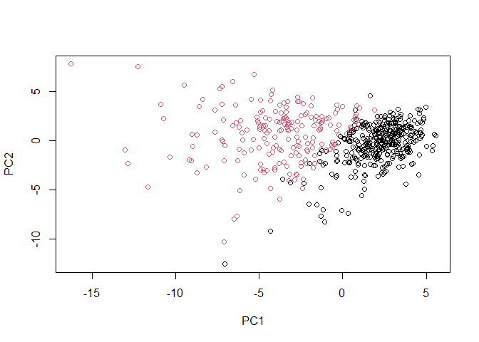
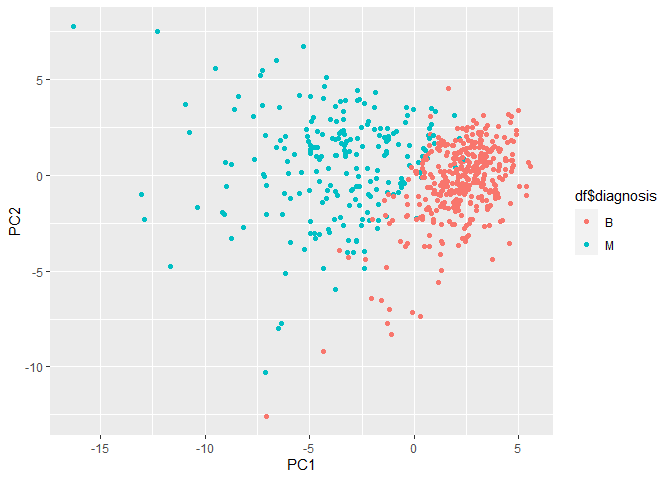
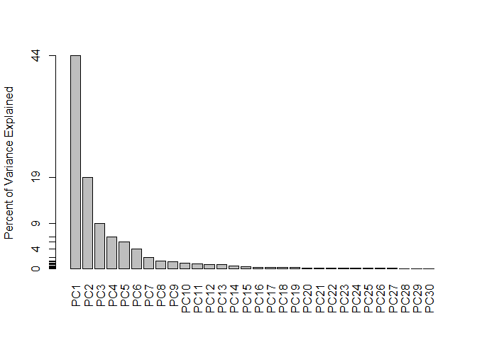
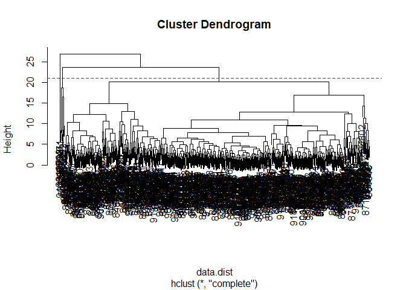
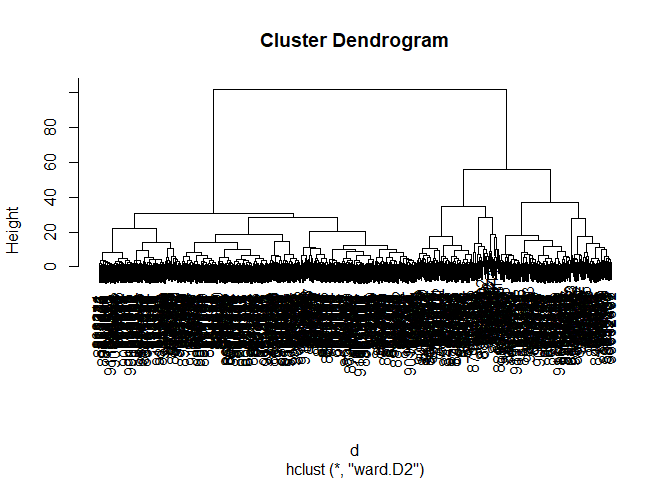
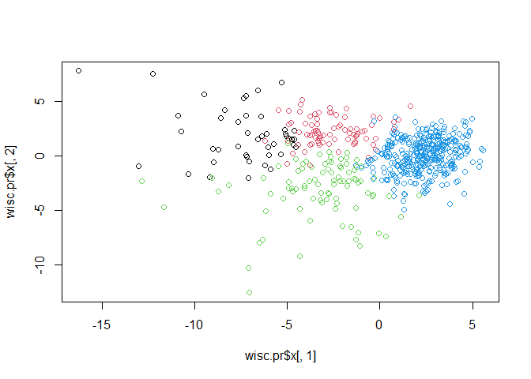

Class08_Mini_Project
================
Joel Kosareff

Input the data

``` r
wisc.df <- read.csv("WisconsinCancer.csv", row.names = 1)
```

``` r
View(wisc.df)
```

Removing the first column as it is the answer to our question.

``` r
wisc.data <- wisc.df[,-1]
```

Save the diagnosis for later

``` r
diagnosis <-as.factor(wisc.df$diagnosis)
```

> Q1 How many observations are in this dataset?

569

``` r
dim(wisc.data)
```

    [1] 569  30

> Q2 How many of the observations have a malignant diagnosis?

212

``` r
table(wisc.df$diagnosis)
```


      B   M 
    357 212 

> Q3 How many variables/features in the data are suffixed with \_mean?

10

``` r
grep("_mean", colnames(wisc.data))
```

     [1]  1  2  3  4  5  6  7  8  9 10

Lets check if the data needs to be re-scaled

``` r
colMeans(wisc.data)
```

                radius_mean            texture_mean          perimeter_mean 
               1.412729e+01            1.928965e+01            9.196903e+01 
                  area_mean         smoothness_mean        compactness_mean 
               6.548891e+02            9.636028e-02            1.043410e-01 
             concavity_mean     concave.points_mean           symmetry_mean 
               8.879932e-02            4.891915e-02            1.811619e-01 
     fractal_dimension_mean               radius_se              texture_se 
               6.279761e-02            4.051721e-01            1.216853e+00 
               perimeter_se                 area_se           smoothness_se 
               2.866059e+00            4.033708e+01            7.040979e-03 
             compactness_se            concavity_se       concave.points_se 
               2.547814e-02            3.189372e-02            1.179614e-02 
                symmetry_se    fractal_dimension_se            radius_worst 
               2.054230e-02            3.794904e-03            1.626919e+01 
              texture_worst         perimeter_worst              area_worst 
               2.567722e+01            1.072612e+02            8.805831e+02 
           smoothness_worst       compactness_worst         concavity_worst 
               1.323686e-01            2.542650e-01            2.721885e-01 
       concave.points_worst          symmetry_worst fractal_dimension_worst 
               1.146062e-01            2.900756e-01            8.394582e-02 

``` r
apply(wisc.data, 2, sd)
```

                radius_mean            texture_mean          perimeter_mean 
               3.524049e+00            4.301036e+00            2.429898e+01 
                  area_mean         smoothness_mean        compactness_mean 
               3.519141e+02            1.406413e-02            5.281276e-02 
             concavity_mean     concave.points_mean           symmetry_mean 
               7.971981e-02            3.880284e-02            2.741428e-02 
     fractal_dimension_mean               radius_se              texture_se 
               7.060363e-03            2.773127e-01            5.516484e-01 
               perimeter_se                 area_se           smoothness_se 
               2.021855e+00            4.549101e+01            3.002518e-03 
             compactness_se            concavity_se       concave.points_se 
               1.790818e-02            3.018606e-02            6.170285e-03 
                symmetry_se    fractal_dimension_se            radius_worst 
               8.266372e-03            2.646071e-03            4.833242e+00 
              texture_worst         perimeter_worst              area_worst 
               6.146258e+00            3.360254e+01            5.693570e+02 
           smoothness_worst       compactness_worst         concavity_worst 
               2.283243e-02            1.573365e-01            2.086243e-01 
       concave.points_worst          symmetry_worst fractal_dimension_worst 
               6.573234e-02            6.186747e-02            1.806127e-02 

# Principal Component Analysis

Lets run PCA

``` r
wisc.pr <- prcomp(wisc.data, scale = TRUE )
```

``` r
summary(wisc.pr)
```

    Importance of components:
                              PC1    PC2     PC3     PC4     PC5     PC6     PC7
    Standard deviation     3.6444 2.3857 1.67867 1.40735 1.28403 1.09880 0.82172
    Proportion of Variance 0.4427 0.1897 0.09393 0.06602 0.05496 0.04025 0.02251
    Cumulative Proportion  0.4427 0.6324 0.72636 0.79239 0.84734 0.88759 0.91010
                               PC8    PC9    PC10   PC11    PC12    PC13    PC14
    Standard deviation     0.69037 0.6457 0.59219 0.5421 0.51104 0.49128 0.39624
    Proportion of Variance 0.01589 0.0139 0.01169 0.0098 0.00871 0.00805 0.00523
    Cumulative Proportion  0.92598 0.9399 0.95157 0.9614 0.97007 0.97812 0.98335
                              PC15    PC16    PC17    PC18    PC19    PC20   PC21
    Standard deviation     0.30681 0.28260 0.24372 0.22939 0.22244 0.17652 0.1731
    Proportion of Variance 0.00314 0.00266 0.00198 0.00175 0.00165 0.00104 0.0010
    Cumulative Proportion  0.98649 0.98915 0.99113 0.99288 0.99453 0.99557 0.9966
                              PC22    PC23   PC24    PC25    PC26    PC27    PC28
    Standard deviation     0.16565 0.15602 0.1344 0.12442 0.09043 0.08307 0.03987
    Proportion of Variance 0.00091 0.00081 0.0006 0.00052 0.00027 0.00023 0.00005
    Cumulative Proportion  0.99749 0.99830 0.9989 0.99942 0.99969 0.99992 0.99997
                              PC29    PC30
    Standard deviation     0.02736 0.01153
    Proportion of Variance 0.00002 0.00000
    Cumulative Proportion  1.00000 1.00000

> Q4. From your results, what proportion of the original variance is
> captured by the first principal components (PC1)?

44.27%

> Q5. How many principal components (PCs) are required to describe at
> least 70% of the original variance in the data?

3 PCs

> Q6. How many principal components (PCs) are required to describe at
> least 90% of the original variance in the data?

7 PCs

Lets visualize this data

``` r
biplot(wisc.pr)
```


> Q7 What stands out to you about this plot? Is it easy or difficult to
> understand? Why?

There is way too much data in this plot. The numbers and data labels
alone make it impossible to read much less interpret the data.

Lets make a scatterplot instead

``` r
plot(wisc.pr$x[,1], wisc.pr$x[,2], col = diagnosis, xlab = "PC1", ylab = "PC2")
```



Second plot of PC1 and PC3

``` r
plot(wisc.pr$x[,1], wisc.pr$x[,3], col = diagnosis, xlab = "PC1", ylab = "PC3")
```


> Q8. Generate a similar plot for principal components 1 and 3. What do
> you notice about these plots?

These plots are much clearer. In both plots there appears to be a clear
set of malignant data and a clear set of benign data seperated on the
left and the right. This suggests that clustering will work.

Lets use ggplot to make a better graph

``` r
df <- as.data.frame(wisc.pr$x)
df$diagnosis <- diagnosis
```

Lets load ggplot

``` r
library(ggplot2)
```

Now we can make a scatterplot

``` r
ggplot(df) + aes(PC1, PC2, col = df$diagnosis) + geom_point()
```



Next lets examine the variance of our data

``` r
pr.var <- wisc.pr$sdev^2
head(pr.var)
```

    [1] 13.281608  5.691355  2.817949  1.980640  1.648731  1.207357

``` r
pve <- pr.var/sum(pr.var)
plot(pve, xlab="Principal Component",ylab="Proportion of Variance Explained", ylim = c(0,1), type = "o" )
```


``` r
barplot(pve, ylab = "Percent of Variance Explained", names.arg = paste0("PC",1:length(pve)), las=2, axes = FALSE)
axis(2, at=pve, labels=round(pve,2)*100)
```



Lets make some extra graphs with new packages

``` r
#install.packages("factoextra")
```

``` r
library(factoextra)
```

    Welcome! Want to learn more? See two factoextra-related books at https://goo.gl/ve3WBa

``` r
fviz_eig(wisc.pr, addlabels=TRUE)
```


# Examine the PC Loadings

How much do the original variables contribute to the new PCs we
calculated? To get at this data we can look at the `$rotation` component
of the PCA object

``` r
head(wisc.pr$rotation[,1:3])
```

                            PC1         PC2          PC3
    radius_mean      -0.2189024  0.23385713 -0.008531243
    texture_mean     -0.1037246  0.05970609  0.064549903
    perimeter_mean   -0.2275373  0.21518136 -0.009314220
    area_mean        -0.2209950  0.23107671  0.028699526
    smoothness_mean  -0.1425897 -0.18611302 -0.104291904
    compactness_mean -0.2392854 -0.15189161 -0.074091571

Focus in on PC1

``` r
wisc.pr$rotation[,1]
```

                radius_mean            texture_mean          perimeter_mean 
                -0.21890244             -0.10372458             -0.22753729 
                  area_mean         smoothness_mean        compactness_mean 
                -0.22099499             -0.14258969             -0.23928535 
             concavity_mean     concave.points_mean           symmetry_mean 
                -0.25840048             -0.26085376             -0.13816696 
     fractal_dimension_mean               radius_se              texture_se 
                -0.06436335             -0.20597878             -0.01742803 
               perimeter_se                 area_se           smoothness_se 
                -0.21132592             -0.20286964             -0.01453145 
             compactness_se            concavity_se       concave.points_se 
                -0.17039345             -0.15358979             -0.18341740 
                symmetry_se    fractal_dimension_se            radius_worst 
                -0.04249842             -0.10256832             -0.22799663 
              texture_worst         perimeter_worst              area_worst 
                -0.10446933             -0.23663968             -0.22487053 
           smoothness_worst       compactness_worst         concavity_worst 
                -0.12795256             -0.21009588             -0.22876753 
       concave.points_worst          symmetry_worst fractal_dimension_worst 
                -0.25088597             -0.12290456             -0.13178394 

> Q9. For the first principal component, what is the component of the
> loading vector (i.e. wisc.pr\$rotation\[,1\]) for the feature
> concave.points_mean?

``` r
wisc.pr$rotation["concave.points_mean",1]
```

    [1] -0.2608538

-.2608

There is a complicated mix of variables that go together to make up
PC1 - i.e. there are many of the original variables that together
contribute highly to PC1

> Q10. What is the minimum number of principal components required to
> explain 80% of the variance of the data?

5 Components

# Hierarchical Clustering

Lets work on clustering our original data

First lets scale it

``` r
data.scaled <- scale(wisc.data)
```

Next we should calculate the euclidian distance

``` r
data.dist <- dist(data.scaled)
```

Now we use hierarchical clustering

``` r
wisc.hclust <- hclust(data.dist)
```

Now lets plot it

``` r
plot(wisc.hclust)
abline(h=21, col = "red", lty=2)
```



> Q11. Using the plot() and abline() functions, what is the height at
> which the clustering model has 4 clusters?

20

``` r
grps <- cutree(wisc.hclust, k = 3)
table(grps)
```

    grps
      1   2   3 
    560   7   2 

``` r
table(grps, diagnosis)
```

        diagnosis
    grps   B   M
       1 355 205
       2   2   5
       3   0   2

> Q12. Can you find a better cluster vs diagnoses match by cutting into
> a different number of clusters between 2 and 10?

Yes, 3 Clusters

\#Combine Methods

My PCA results were interesting as they showed a separation of M and B
samples along PC1

I want to cluster my PCA results - that is use `wisc.pr$x` as input to
`hclust()`

Try clustering 3 PCs first, that is PC1 PC2 PC3 as input

``` r
d <- dist(wisc.pr$x[,1:7])
wisc.pr.hclust<- hclust(d, method="ward.D2")
```

And my tree result figure

``` r
plot(wisc.pr.hclust)
```



Lets cut this tree into 2 groups

``` r
grps <- cutree(wisc.pr.hclust, k=4)
table(grps)
```

    grps
      1   2   3   4 
     45  79  92 353 

``` r
plot(wisc.pr$x[,1], wisc.pr$x[,2], col=grps)
```



How well do the two clusters seperate the M and B diagnosis?

``` r
table(grps, diagnosis)
```

        diagnosis
    grps   B   M
       1   0  45
       2   2  77
       3  26  66
       4 329  24

``` r
(179+333)/nrow(wisc.data)
```

    [1] 0.8998243

> Q13. Which method gives your favorite results for the same data.dist
> dataset? Explain your reasoning.

I like ward.D2 for creating spherical clusters that are easy to analyze.
It makes clear cases and edge cases easy to see.

> Q15. How well does the newly created model with four clusters separate
> out the two diagnoses?

The 4 cluster model groups most of the benign diagnoses into a single
group pretty clearly and separates the malignant into 3 groups. There
are several false negative and positives but the data is generally well
aligned with about a 90% success rate

``` r
table(grps, diagnosis)
```

        diagnosis
    grps   B   M
       1   0  45
       2   2  77
       3  26  66
       4 329  24
