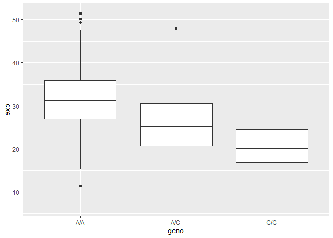

Class11
================
Joel Kosareff

> Q13: Read this file into R and determine the sample size for each
> genotype and their corresponding median expression levels for each of
> these genotypes.

``` r
Data <- read.table("https://bioboot.github.io/bggn213_W19/class-material/rs8067378_ENSG00000172057.6.txt")
View(Data)
```

``` r
summary(Data)
```

        sample              geno                exp        
     Length:462         Length:462         Min.   : 6.675  
     Class :character   Class :character   1st Qu.:20.004  
     Mode  :character   Mode  :character   Median :25.116  
                                           Mean   :25.640  
                                           3rd Qu.:30.779  
                                           Max.   :51.518  

``` r
library(stringr)
sum(str_count(Data$geno, "A/A"))
```

    [1] 108

``` r
sum(str_count(Data$geno, "A/G"))
```

    [1] 233

``` r
sum(str_count(Data$geno, "G/G"))
```

    [1] 121

There are 108 A/A, 233 A/G and 121 G/G

``` r
median(Data$exp[str_detect(Data$geno, "A/A")])
```

    [1] 31.24847

``` r
median(Data$exp[str_detect(Data$geno, "A/G")])
```

    [1] 25.06486

``` r
median(Data$exp[str_detect(Data$geno, "G/G")])
```

    [1] 20.07363

Median of A/A: 31.25 Median of A/G: 25.06 Median of G/G: 20.07

> Q14: Generate a boxplot with a box per genotype, what could you infer
> from the relative expression value between A/A and G/G displayed in
> this plot? Does the SNP effect the expression of ORMDL3?

``` r
library(ggplot2)
```

``` r
ggplot(Data) + aes(geno, exp) + geom_boxplot()
```



It would appear that Asthma is expressed higher in the A/A population
than it is in the G/G population. This proposes that the SNP does in
fact have an effect on the expression of ORMDL3
