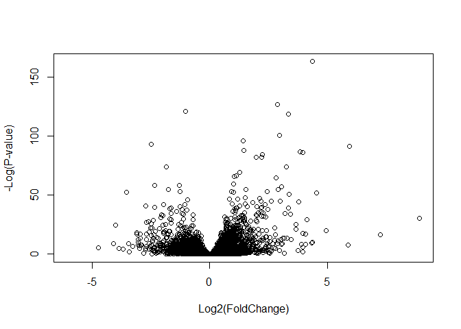
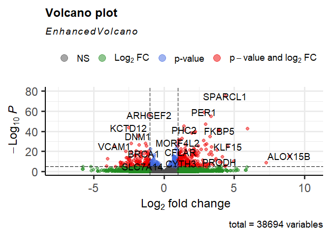

Class12
================
Joel Kosareff

Installing BioConductor packages

``` r
#install.packages("BiocManager")
#BiocManager::install()
```

``` r
#BiocManager::install("DESeq2")
```

Now read them in

``` r
library(BiocManager)
library(DESeq2)
```

    Loading required package: S4Vectors

    Loading required package: stats4

    Loading required package: BiocGenerics


    Attaching package: 'BiocGenerics'

    The following objects are masked from 'package:stats':

        IQR, mad, sd, var, xtabs

    The following objects are masked from 'package:base':

        anyDuplicated, aperm, append, as.data.frame, basename, cbind,
        colnames, dirname, do.call, duplicated, eval, evalq, Filter, Find,
        get, grep, grepl, intersect, is.unsorted, lapply, Map, mapply,
        match, mget, order, paste, pmax, pmax.int, pmin, pmin.int,
        Position, rank, rbind, Reduce, rownames, sapply, setdiff, sort,
        table, tapply, union, unique, unsplit, which.max, which.min


    Attaching package: 'S4Vectors'

    The following objects are masked from 'package:base':

        expand.grid, I, unname

    Loading required package: IRanges


    Attaching package: 'IRanges'

    The following object is masked from 'package:grDevices':

        windows

    Loading required package: GenomicRanges

    Loading required package: GenomeInfoDb

    Loading required package: SummarizedExperiment

    Loading required package: MatrixGenerics

    Loading required package: matrixStats


    Attaching package: 'MatrixGenerics'

    The following objects are masked from 'package:matrixStats':

        colAlls, colAnyNAs, colAnys, colAvgsPerRowSet, colCollapse,
        colCounts, colCummaxs, colCummins, colCumprods, colCumsums,
        colDiffs, colIQRDiffs, colIQRs, colLogSumExps, colMadDiffs,
        colMads, colMaxs, colMeans2, colMedians, colMins, colOrderStats,
        colProds, colQuantiles, colRanges, colRanks, colSdDiffs, colSds,
        colSums2, colTabulates, colVarDiffs, colVars, colWeightedMads,
        colWeightedMeans, colWeightedMedians, colWeightedSds,
        colWeightedVars, rowAlls, rowAnyNAs, rowAnys, rowAvgsPerColSet,
        rowCollapse, rowCounts, rowCummaxs, rowCummins, rowCumprods,
        rowCumsums, rowDiffs, rowIQRDiffs, rowIQRs, rowLogSumExps,
        rowMadDiffs, rowMads, rowMaxs, rowMeans2, rowMedians, rowMins,
        rowOrderStats, rowProds, rowQuantiles, rowRanges, rowRanks,
        rowSdDiffs, rowSds, rowSums2, rowTabulates, rowVarDiffs, rowVars,
        rowWeightedMads, rowWeightedMeans, rowWeightedMedians,
        rowWeightedSds, rowWeightedVars

    Loading required package: Biobase

    Welcome to Bioconductor

        Vignettes contain introductory material; view with
        'browseVignettes()'. To cite Bioconductor, see
        'citation("Biobase")', and for packages 'citation("pkgname")'.


    Attaching package: 'Biobase'

    The following object is masked from 'package:MatrixGenerics':

        rowMedians

    The following objects are masked from 'package:matrixStats':

        anyMissing, rowMedians

\##Import countData and colData

``` r
counts <- read.csv("airway_scaledcounts.csv", row.names=1)
metadata <-  read.csv("airway_metadata.csv")
```

``` r
head(counts)
```

                    SRR1039508 SRR1039509 SRR1039512 SRR1039513 SRR1039516
    ENSG00000000003        723        486        904        445       1170
    ENSG00000000005          0          0          0          0          0
    ENSG00000000419        467        523        616        371        582
    ENSG00000000457        347        258        364        237        318
    ENSG00000000460         96         81         73         66        118
    ENSG00000000938          0          0          1          0          2
                    SRR1039517 SRR1039520 SRR1039521
    ENSG00000000003       1097        806        604
    ENSG00000000005          0          0          0
    ENSG00000000419        781        417        509
    ENSG00000000457        447        330        324
    ENSG00000000460         94        102         74
    ENSG00000000938          0          0          0

``` r
head(metadata)
```

              id     dex celltype     geo_id
    1 SRR1039508 control   N61311 GSM1275862
    2 SRR1039509 treated   N61311 GSM1275863
    3 SRR1039512 control  N052611 GSM1275866
    4 SRR1039513 treated  N052611 GSM1275867
    5 SRR1039516 control  N080611 GSM1275870
    6 SRR1039517 treated  N080611 GSM1275871

> Q1. How many genes are in this dataset?

``` r
nrow(counts)
```

    [1] 38694

> Q2. How many ‘control’ cell lines do we have? 4

``` r
View(metadata)
```

\##Toy Differential Gene Expression

Lets perform some exploratory differential gene expression analysis.
Note: this analysis is for demonstration only. NEVER do differential
expression analysis this way!

``` r
control <- metadata[metadata[,"dex"]=="control",]
control.counts <- counts[ ,control$id]
control.mean <- rowSums( control.counts )/4 
head(control.mean)
```

    ENSG00000000003 ENSG00000000005 ENSG00000000419 ENSG00000000457 ENSG00000000460 
             900.75            0.00          520.50          339.75           97.25 
    ENSG00000000938 
               0.75 

``` r
library(dplyr)
```


    Attaching package: 'dplyr'

    The following object is masked from 'package:Biobase':

        combine

    The following object is masked from 'package:matrixStats':

        count

    The following objects are masked from 'package:GenomicRanges':

        intersect, setdiff, union

    The following object is masked from 'package:GenomeInfoDb':

        intersect

    The following objects are masked from 'package:IRanges':

        collapse, desc, intersect, setdiff, slice, union

    The following objects are masked from 'package:S4Vectors':

        first, intersect, rename, setdiff, setequal, union

    The following objects are masked from 'package:BiocGenerics':

        combine, intersect, setdiff, union

    The following objects are masked from 'package:stats':

        filter, lag

    The following objects are masked from 'package:base':

        intersect, setdiff, setequal, union

``` r
control <- metadata %>% filter(dex=="control")
control.counts <- counts %>% select(control$id) 
control.mean <- rowSums(control.counts)/4
head(control.mean)
```

    ENSG00000000003 ENSG00000000005 ENSG00000000419 ENSG00000000457 ENSG00000000460 
             900.75            0.00          520.50          339.75           97.25 
    ENSG00000000938 
               0.75 

> Q3. How would you make the above code in either approach more robust?

You could write a function that takes input x where x is the “control”
or other variable that we are looking for

> Q4. Follow the same procedure for the treated samples (i.e. calculate
> the mean per gene across drug treated samples and assign to a labeled
> vector called treated.mean)

``` r
treated <- metadata[metadata[,"dex"]=="treated",]
treated.counts <- counts[ ,treated$id]
treated.mean <- rowSums( treated.counts )/4 
head(treated.mean)
```

    ENSG00000000003 ENSG00000000005 ENSG00000000419 ENSG00000000457 ENSG00000000460 
             658.00            0.00          546.00          316.50           78.75 
    ENSG00000000938 
               0.00 

We will combine our meancount data for bookkeeping purposes.

``` r
meancounts <- data.frame(control.mean, treated.mean)
colSums(meancounts)
```

    control.mean treated.mean 
        23005324     22196524 

> Q5 (a). Create a scatter plot showing the mean of the treated samples
> against the mean of the control samples. Your plot should look
> something like the following.

``` r
plot(meancounts)
```


> Q5 (b).You could also use the ggplot2 package to make this figure
> producing the plot below. What geom\_?() function would you use for
> this plot?

geom_point

> Q6. Try plotting both axes on a log scale. What is the argument to
> plot() that allows you to do this?

``` r
plot(meancounts, log = "xy")
```

    Warning in xy.coords(x, y, xlabel, ylabel, log): 15032 x values <= 0 omitted
    from logarithmic plot

    Warning in xy.coords(x, y, xlabel, ylabel, log): 15281 y values <= 0 omitted
    from logarithmic plot


We can find candidate differentially expressed genes by looking for
genes with a large change between control and dex-treated samples. We
usually look at the log2 of the fold change, because this has better
mathematical properties.

Here we calculate log2foldchange, add it to our meancounts data.frame
and inspect the results either with the head() or the View() function
for example.

``` r
meancounts$log2fc <- log2(meancounts[,"treated.mean"]/meancounts[,"control.mean"])
head(meancounts)
```

                    control.mean treated.mean      log2fc
    ENSG00000000003       900.75       658.00 -0.45303916
    ENSG00000000005         0.00         0.00         NaN
    ENSG00000000419       520.50       546.00  0.06900279
    ENSG00000000457       339.75       316.50 -0.10226805
    ENSG00000000460        97.25        78.75 -0.30441833
    ENSG00000000938         0.75         0.00        -Inf

Next lets filter our results to remove some odd datapoints

``` r
zero.vals <- which(meancounts[,1:2]==0, arr.ind=TRUE)

to.rm <- unique(zero.vals[,1])
mycounts <- meancounts[-to.rm,]
head(mycounts)
```

                    control.mean treated.mean      log2fc
    ENSG00000000003       900.75       658.00 -0.45303916
    ENSG00000000419       520.50       546.00  0.06900279
    ENSG00000000457       339.75       316.50 -0.10226805
    ENSG00000000460        97.25        78.75 -0.30441833
    ENSG00000000971      5219.00      6687.50  0.35769358
    ENSG00000001036      2327.00      1785.75 -0.38194109

> 7.  What is the purpose of the arr.ind argument in the which()
>     function call above? Why would we then take the first column of
>     the output and need to call the unique() function?

arr.ind will check both the row and columns for TRUE values instead of
just one. We call unique to make sure that we arent checking one gene
twice

A common threshold used for calling something differentially expressed
is a log2(FoldChange) of greater than 2 or less than -2. Let’s filter
the dataset both ways to see how many genes are up or down-regulated.

``` r
up.ind <- mycounts$log2fc > 2
down.ind <- mycounts$log2fc < (-2)
```

> Q8. Using the up.ind vector above can you determine how many up
> regulated genes we have at the greater than 2 fc level?

``` r
sum(up.ind)
```

    [1] 250

> Q9. Using the down.ind vector above can you determine how many down
> regulated genes we have at the greater than 2 fc level?

``` r
sum(down.ind)
```

    [1] 367

These data sets haven’t checked for any kind of statistical significance
so it’s difficult to trust their accuracy

\##DESeq2 analysis

``` r
library(DESeq2)
citation("DESeq2")
```


    To cite package 'DESeq2' in publications use:

      Love, M.I., Huber, W., Anders, S. Moderated estimation of fold change
      and dispersion for RNA-seq data with DESeq2 Genome Biology 15(12):550
      (2014)

    A BibTeX entry for LaTeX users is

      @Article{,
        title = {Moderated estimation of fold change and dispersion for RNA-seq data with DESeq2},
        author = {Michael I. Love and Wolfgang Huber and Simon Anders},
        year = {2014},
        journal = {Genome Biology},
        doi = {10.1186/s13059-014-0550-8},
        volume = {15},
        issue = {12},
        pages = {550},
      }

Take a look at metadata again. The thing we’re interested in is the dex
column, which tells us which samples are treated with dexamethasone
versus which samples are untreated controls. We will use the
DESeqDataSetFromMatrix() function to build the required DESeqDataSet
object and call it dds, short for our DESeqDataSet.

``` r
dds <- DESeqDataSetFromMatrix(countData=counts, 
                              colData=metadata, 
                              design=~dex)
```

    converting counts to integer mode

    Warning in DESeqDataSet(se, design = design, ignoreRank): some variables in
    design formula are characters, converting to factors

``` r
dds
```

    class: DESeqDataSet 
    dim: 38694 8 
    metadata(1): version
    assays(1): counts
    rownames(38694): ENSG00000000003 ENSG00000000005 ... ENSG00000283120
      ENSG00000283123
    rowData names(0):
    colnames(8): SRR1039508 SRR1039509 ... SRR1039520 SRR1039521
    colData names(4): id dex celltype geo_id

Next, let’s run the DESeq analysis pipeline on the dataset, and reassign
the resulting object back to the same variable.

Notice how if we try to access these results before running the
analysis, nothing exists.

``` r
#results(dds)
```

We need to run DESEQ before checking results

``` r
dds <- DESeq(dds)
```

    estimating size factors

    estimating dispersions

    gene-wise dispersion estimates

    mean-dispersion relationship

    final dispersion estimates

    fitting model and testing

``` r
res <- results(dds)
res
```

    log2 fold change (MLE): dex treated vs control 
    Wald test p-value: dex treated vs control 
    DataFrame with 38694 rows and 6 columns
                     baseMean log2FoldChange     lfcSE      stat    pvalue
                    <numeric>      <numeric> <numeric> <numeric> <numeric>
    ENSG00000000003  747.1942     -0.3507030  0.168246 -2.084470 0.0371175
    ENSG00000000005    0.0000             NA        NA        NA        NA
    ENSG00000000419  520.1342      0.2061078  0.101059  2.039475 0.0414026
    ENSG00000000457  322.6648      0.0245269  0.145145  0.168982 0.8658106
    ENSG00000000460   87.6826     -0.1471420  0.257007 -0.572521 0.5669691
    ...                   ...            ...       ...       ...       ...
    ENSG00000283115  0.000000             NA        NA        NA        NA
    ENSG00000283116  0.000000             NA        NA        NA        NA
    ENSG00000283119  0.000000             NA        NA        NA        NA
    ENSG00000283120  0.974916      -0.668258   1.69456 -0.394354  0.693319
    ENSG00000283123  0.000000             NA        NA        NA        NA
                         padj
                    <numeric>
    ENSG00000000003  0.163035
    ENSG00000000005        NA
    ENSG00000000419  0.176032
    ENSG00000000457  0.961694
    ENSG00000000460  0.815849
    ...                   ...
    ENSG00000283115        NA
    ENSG00000283116        NA
    ENSG00000283119        NA
    ENSG00000283120        NA
    ENSG00000283123        NA

``` r
res <- as.data.frame(res)
View(res)
```

We can summarize some basic tallies using the summary function.

``` r
summary(res)
```

        baseMean        log2FoldChange       lfcSE            stat        
     Min.   :     0.0   Min.   :-6.030   Min.   :0.057   Min.   :-15.894  
     1st Qu.:     0.0   1st Qu.:-0.425   1st Qu.:0.174   1st Qu.: -0.643  
     Median :     1.1   Median :-0.009   Median :0.445   Median : -0.027  
     Mean   :   570.2   Mean   :-0.011   Mean   :1.136   Mean   :  0.045  
     3rd Qu.:   201.8   3rd Qu.: 0.306   3rd Qu.:1.848   3rd Qu.:  0.593  
     Max.   :329280.4   Max.   : 8.906   Max.   :3.534   Max.   : 18.422  
                        NA's   :13436    NA's   :13436   NA's   :13436    
         pvalue           padj      
     Min.   :0.000   Min.   :0.000  
     1st Qu.:0.168   1st Qu.:0.203  
     Median :0.533   Median :0.606  
     Mean   :0.495   Mean   :0.539  
     3rd Qu.:0.800   3rd Qu.:0.866  
     Max.   :1.000   Max.   :1.000  
     NA's   :13578   NA's   :23549  

``` r
res05 <- results(dds, alpha=0.05)
summary(res05)
```


    out of 25258 with nonzero total read count
    adjusted p-value < 0.05
    LFC > 0 (up)       : 1236, 4.9%
    LFC < 0 (down)     : 933, 3.7%
    outliers [1]       : 142, 0.56%
    low counts [2]     : 9033, 36%
    (mean count < 6)
    [1] see 'cooksCutoff' argument of ?results
    [2] see 'independentFiltering' argument of ?results

\##Adding Annotation Data

We will use one of Bioconductor’s main annotation packages to help with
mapping between various ID schemes. Here we load the AnnotationDbi
package and the annotation data package for humans org.Hs.eg.db.

``` r
#BiocManager::install("org.Hs.eg.db")
```

``` r
library("AnnotationDbi")
```


    Attaching package: 'AnnotationDbi'

    The following object is masked from 'package:dplyr':

        select

``` r
library("org.Hs.eg.db")
```

The later of these is is the organism annotation package (“org”) for
Homo sapiens (“Hs”), organized as an AnnotationDbi database package
(“db”), using Entrez Gene IDs (“eg”) as primary key. To get a list of
all available key types that we can use to map between, use the
columns() function:

``` r
columns(org.Hs.eg.db)
```

     [1] "ACCNUM"       "ALIAS"        "ENSEMBL"      "ENSEMBLPROT"  "ENSEMBLTRANS"
     [6] "ENTREZID"     "ENZYME"       "EVIDENCE"     "EVIDENCEALL"  "GENENAME"    
    [11] "GENETYPE"     "GO"           "GOALL"        "IPI"          "MAP"         
    [16] "OMIM"         "ONTOLOGY"     "ONTOLOGYALL"  "PATH"         "PFAM"        
    [21] "PMID"         "PROSITE"      "REFSEQ"       "SYMBOL"       "UCSCKG"      
    [26] "UNIPROT"     

The main function we will use from the AnnotationDbi package is called
mapIds().

We can use the mapIds() function to add individual columns to our
results table. We provide the row names of our results table as a key,
and specify that keytype=ENSEMBL. The column argument tells the mapIds()
function which information we want, and the multiVals argument tells the
function what to do if there are multiple possible values for a single
input value. Here we ask to just give us back the first one that occurs
in the database.

``` r
res$symbol <- mapIds(org.Hs.eg.db,
                     keys=row.names(res), # Our genenames
                     keytype="ENSEMBL",        # The format of our genenames
                     column="SYMBOL",          # The new format we want to add
                     multiVals="first")
```

    'select()' returned 1:many mapping between keys and columns

``` r
head(res)
```

                       baseMean log2FoldChange     lfcSE       stat     pvalue
    ENSG00000000003 747.1941954    -0.35070302 0.1682457 -2.0844697 0.03711747
    ENSG00000000005   0.0000000             NA        NA         NA         NA
    ENSG00000000419 520.1341601     0.20610777 0.1010592  2.0394752 0.04140263
    ENSG00000000457 322.6648439     0.02452695 0.1451451  0.1689823 0.86581056
    ENSG00000000460  87.6826252    -0.14714205 0.2570073 -0.5725210 0.56696907
    ENSG00000000938   0.3191666    -1.73228897 3.4936010 -0.4958463 0.62000288
                         padj   symbol
    ENSG00000000003 0.1630348   TSPAN6
    ENSG00000000005        NA     TNMD
    ENSG00000000419 0.1760317     DPM1
    ENSG00000000457 0.9616942    SCYL3
    ENSG00000000460 0.8158486 C1orf112
    ENSG00000000938        NA      FGR

> Q11. Run the mapIds() function two more times to add the Entrez ID and
> UniProt accession and GENENAME as new columns called
> res$entrez, res$uniprot and res\$genename.

``` r
res$entrez <- mapIds(org.Hs.eg.db,
                     keys=row.names(res),
                     column="ENTREZID",
                     keytype="ENSEMBL",
                     multiVals="first")
```

    'select()' returned 1:many mapping between keys and columns

``` r
res$uniprot <- mapIds(org.Hs.eg.db,
                     keys=row.names(res),
                     column="UNIPROT",
                     keytype="ENSEMBL",
                     multiVals="first")
```

    'select()' returned 1:many mapping between keys and columns

``` r
res$genename <- mapIds(org.Hs.eg.db,
                     keys=row.names(res),
                     column="GENENAME",
                     keytype="ENSEMBL",
                     multiVals="first")
```

    'select()' returned 1:many mapping between keys and columns

``` r
head(res)
```

                       baseMean log2FoldChange     lfcSE       stat     pvalue
    ENSG00000000003 747.1941954    -0.35070302 0.1682457 -2.0844697 0.03711747
    ENSG00000000005   0.0000000             NA        NA         NA         NA
    ENSG00000000419 520.1341601     0.20610777 0.1010592  2.0394752 0.04140263
    ENSG00000000457 322.6648439     0.02452695 0.1451451  0.1689823 0.86581056
    ENSG00000000460  87.6826252    -0.14714205 0.2570073 -0.5725210 0.56696907
    ENSG00000000938   0.3191666    -1.73228897 3.4936010 -0.4958463 0.62000288
                         padj   symbol entrez    uniprot
    ENSG00000000003 0.1630348   TSPAN6   7105 A0A024RCI0
    ENSG00000000005        NA     TNMD  64102     Q9H2S6
    ENSG00000000419 0.1760317     DPM1   8813     O60762
    ENSG00000000457 0.9616942    SCYL3  57147     Q8IZE3
    ENSG00000000460 0.8158486 C1orf112  55732 A0A024R922
    ENSG00000000938        NA      FGR   2268     P09769
                                                                       genename
    ENSG00000000003                                               tetraspanin 6
    ENSG00000000005                                                 tenomodulin
    ENSG00000000419 dolichyl-phosphate mannosyltransferase subunit 1, catalytic
    ENSG00000000457                                    SCY1 like pseudokinase 3
    ENSG00000000460                         chromosome 1 open reading frame 112
    ENSG00000000938              FGR proto-oncogene, Src family tyrosine kinase

You can arrange and view the results by the adjusted p-value

``` r
ord <- order( res$padj )
#View(res[ord,])
head(res[ord,])
```

                      baseMean log2FoldChange      lfcSE      stat       pvalue
    ENSG00000152583   954.7709       4.368359 0.23712679  18.42204 8.744898e-76
    ENSG00000179094   743.2527       2.863889 0.17556931  16.31201 8.107836e-60
    ENSG00000116584  2277.9135      -1.034701 0.06509844 -15.89440 6.928546e-57
    ENSG00000189221  2383.7537       3.341544 0.21240579  15.73189 9.144326e-56
    ENSG00000120129  3440.7038       2.965211 0.20369513  14.55710 5.264243e-48
    ENSG00000148175 13493.9204       1.427168 0.10038904  14.21638 7.251278e-46
                            padj  symbol entrez    uniprot
    ENSG00000152583 1.324415e-71 SPARCL1   8404 A0A024RDE1
    ENSG00000179094 6.139658e-56    PER1   5187     O15534
    ENSG00000116584 3.497761e-53 ARHGEF2   9181     Q92974
    ENSG00000189221 3.462270e-52    MAOA   4128     P21397
    ENSG00000120129 1.594539e-44   DUSP1   1843     B4DU40
    ENSG00000148175 1.830344e-42    STOM   2040     F8VSL7
                                                        genename
    ENSG00000152583                                 SPARC like 1
    ENSG00000179094                 period circadian regulator 1
    ENSG00000116584 Rho/Rac guanine nucleotide exchange factor 2
    ENSG00000189221                          monoamine oxidase A
    ENSG00000120129               dual specificity phosphatase 1
    ENSG00000148175                                     stomatin

Finally, let’s write out the ordered significant results with
annotations.

``` r
write.csv(res[ord,], "deseq_results.csv")
```

\##Data Visualization

Let’s make a commonly produced visualization from this data, namely a
so-called Volcano plot.

``` r
plot( res$log2FoldChange,  -log(res$padj), 
      xlab="Log2(FoldChange)",
      ylab="-Log(P-value)")
```



To make this more useful we can add some guidelines (with the abline()
function) and color (with a custom color vector) highlighting genes that
have padj\<0.05 and the absolute log2FoldChange\>2.

``` r
plot( res$log2FoldChange,  -log(res$padj), 
 ylab="-Log(P-value)", xlab="Log2(FoldChange)")

# Add some cut-off lines
abline(v=c(-2,2), col="darkgray", lty=2)
abline(h=-log(0.05), col="darkgray", lty=2)
```


To color the points we will setup a custom color vector indicating
transcripts with large fold change and significant differences between
conditions:

``` r
mycols <- rep("gray", nrow(res))
mycols[ abs(res$log2FoldChange) > 2 ]  <- "red" 

inds <- (res$padj < 0.01) & (abs(res$log2FoldChange) > 2 )
mycols[ inds ] <- "blue"

# Volcano plot with custom colors 
plot( res$log2FoldChange,  -log(res$padj), 
 col=mycols, ylab="-Log(P-value)", xlab="Log2(FoldChange)" )

# Cut-off lines
abline(v=c(-2,2), col="gray", lty=2)
abline(h=-log(0.1), col="gray", lty=2)
```


For even more customization you might find the EnhancedVolcano
bioconductor package useful (Note. It uses ggplot under the hood):

First we will add the more understandable gene symbol names to our full
results object res as we will use this to label the most interesting
genes in our final plot.

``` r
#BiocManager::install("EnhancedVolcano")
```

``` r
library(EnhancedVolcano)
```

    Loading required package: ggplot2

    Loading required package: ggrepel

``` r
x <- as.data.frame(res)

EnhancedVolcano(x,
    lab = x$symbol,
    x = 'log2FoldChange',
    y = 'pvalue')
```



\##Pathway Analysis

Pathway analysis (also known as gene set analysis or over-representation
analysis), aims to reduce the complexity of interpreting gene lists via
mapping the listed genes to known (i.e. annotated) biological pathways,
processes and functions

Lets load some packages and setup our KEEG datasets

``` r
library(pathview)
```

    ##############################################################################
    Pathview is an open source software package distributed under GNU General
    Public License version 3 (GPLv3). Details of GPLv3 is available at
    http://www.gnu.org/licenses/gpl-3.0.html. Particullary, users are required to
    formally cite the original Pathview paper (not just mention it) in publications
    or products. For details, do citation("pathview") within R.

    The pathview downloads and uses KEGG data. Non-academic uses may require a KEGG
    license agreement (details at http://www.kegg.jp/kegg/legal.html).
    ##############################################################################

``` r
library(gage)
```

``` r
library(gageData)

data(kegg.sets.hs)

# Examine the first 2 pathways in this kegg set for humans
head(kegg.sets.hs, 2)
```

    $`hsa00232 Caffeine metabolism`
    [1] "10"   "1544" "1548" "1549" "1553" "7498" "9"   

    $`hsa00983 Drug metabolism - other enzymes`
     [1] "10"     "1066"   "10720"  "10941"  "151531" "1548"   "1549"   "1551"  
     [9] "1553"   "1576"   "1577"   "1806"   "1807"   "1890"   "221223" "2990"  
    [17] "3251"   "3614"   "3615"   "3704"   "51733"  "54490"  "54575"  "54576" 
    [25] "54577"  "54578"  "54579"  "54600"  "54657"  "54658"  "54659"  "54963" 
    [33] "574537" "64816"  "7083"   "7084"   "7172"   "7363"   "7364"   "7365"  
    [41] "7366"   "7367"   "7371"   "7372"   "7378"   "7498"   "79799"  "83549" 
    [49] "8824"   "8833"   "9"      "978"   

The main gage() function requires a named vector of fold changes, where
the names of the values are the Entrez gene IDs.

Note that we used the mapIDs() function above to obtain Entrez gene IDs
(stored in
res$entrez) and we have the fold change results from DESeq2 analysis (stored in res$log2FoldChange).

``` r
foldchanges = res$log2FoldChange
names(foldchanges) = res$entrez
head(foldchanges)
```

           7105       64102        8813       57147       55732        2268 
    -0.35070302          NA  0.20610777  0.02452695 -0.14714205 -1.73228897 

Now, let’s run the gage pathway analysis

``` r
keggres = gage(foldchanges, gsets=kegg.sets.hs)
```

Now lets look at the object returned from gage().

``` r
attributes(keggres)
```

    $names
    [1] "greater" "less"    "stats"  

Lets look at the first few down (less) pathway results:

``` r
head(keggres$less, 3)
```

                                          p.geomean stat.mean        p.val
    hsa05332 Graft-versus-host disease 0.0004250461 -3.473346 0.0004250461
    hsa04940 Type I diabetes mellitus  0.0017820293 -3.002352 0.0017820293
    hsa05310 Asthma                    0.0020045888 -3.009050 0.0020045888
                                            q.val set.size         exp1
    hsa05332 Graft-versus-host disease 0.09053483       40 0.0004250461
    hsa04940 Type I diabetes mellitus  0.14232581       42 0.0017820293
    hsa05310 Asthma                    0.14232581       29 0.0020045888

Each keggres$less and keggres$greater object is data matrix with gene
sets as rows sorted by p-value.

The top three Kegg pathways indicated here include Graft-versus-host
disease, Type I diabetes and the Asthma pathway (with pathway ID
hsa05310).

Now, let’s try out the pathview() function from the pathview package to
make a pathway plot with our RNA-Seq expression results shown in color.
To begin with lets manually supply a pathway.id (namely the first part
of the “hsa05310 Asthma”) that we could see from the print out above.

``` r
pathview(gene.data=foldchanges, pathway.id="hsa05310")
```

    'select()' returned 1:1 mapping between keys and columns

    Info: Working in directory C:/Users/joelk/Documents/BIMM143/bimm143_github/Class12

    Info: Writing image file hsa05310.pathview.png

Note how many of the genes in this pathway are perturbed (i.e. colored)
in our results.

You can play with the other input arguments to pathview() to change the
display in various ways including generating a PDF graph. For example:

``` r
pathview(gene.data=foldchanges, pathway.id="hsa05310", kegg.native=FALSE)
```

    'select()' returned 1:1 mapping between keys and columns

    Info: Working in directory C:/Users/joelk/Documents/BIMM143/bimm143_github/Class12

    Info: Writing image file hsa05310.pathview.pdf

> Q12. Can you do the same procedure as above to plot the pathview
> figures for the top 2 down-reguled pathways?

``` r
pathview(gene.data=foldchanges, pathway.id="hsa05332", kegg.native=FALSE)
```

    'select()' returned 1:1 mapping between keys and columns

    Warning in .subtypeDisplay(object): Given subtype 'missing interaction' is not found!

    Info: Working in directory C:/Users/joelk/Documents/BIMM143/bimm143_github/Class12

    Info: Writing image file hsa05332.pathview.pdf

``` r
pathview(gene.data=foldchanges, pathway.id="hsa04940", kegg.native=FALSE)
```

    'select()' returned 1:1 mapping between keys and columns

    Info: Working in directory C:/Users/joelk/Documents/BIMM143/bimm143_github/Class12

    Info: Writing image file hsa04940.pathview.pdf
