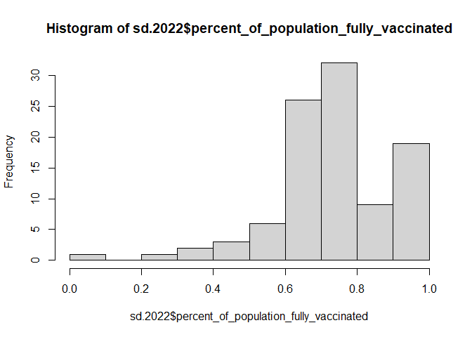
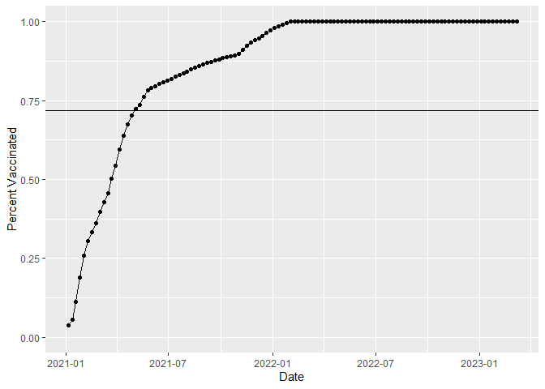
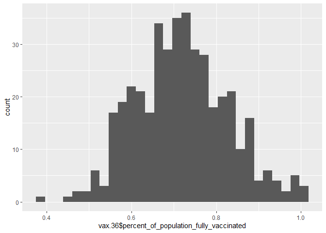
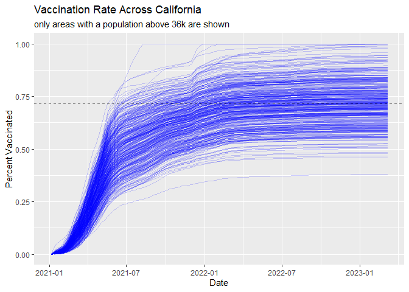

Class17
================
Joel Kosareff

Lets import the vaccination data

``` r
vax <- read.csv("covid19vac.csv")
View(vax)
```

> Q1. What column details the total number of people fully vaccinated?

persons_fully_vaccinated

> Q2. What column details the Zip code tabulation area?

zip_code_tabulation_area \>Q3. What is the earliest date in this
dataset?

``` r
vax$as_of_date[1]
```

    [1] "2021-01-05"

> Q4. What is the latest date in this dataset?

``` r
tail(vax$as_of_date, 1)
```

    [1] "2023-03-07"

Lets call skim to get an overview

``` r
skimr::skim(vax)
```

|                                                  |        |
|:-------------------------------------------------|:-------|
| Name                                             | vax    |
| Number of rows                                   | 201096 |
| Number of columns                                | 18     |
| \_\_\_\_\_\_\_\_\_\_\_\_\_\_\_\_\_\_\_\_\_\_\_   |        |
| Column type frequency:                           |        |
| character                                        | 5      |
| numeric                                          | 13     |
| \_\_\_\_\_\_\_\_\_\_\_\_\_\_\_\_\_\_\_\_\_\_\_\_ |        |
| Group variables                                  | None   |

Data summary

**Variable type: character**

| skim_variable             | n_missing | complete_rate | min | max | empty | n_unique | whitespace |
|:--------------------------|----------:|--------------:|----:|----:|------:|---------:|-----------:|
| as_of_date                |         0 |             1 |  10 |  10 |     0 |      114 |          0 |
| local_health_jurisdiction |         0 |             1 |   0 |  15 |   570 |       62 |          0 |
| county                    |         0 |             1 |   0 |  15 |   570 |       59 |          0 |
| vem_source                |         0 |             1 |  15 |  26 |     0 |        3 |          0 |
| redacted                  |         0 |             1 |   2 |  69 |     0 |        2 |          0 |

**Variable type: numeric**

| skim_variable                              | n_missing | complete_rate |     mean |       sd |    p0 |      p25 |      p50 |      p75 |     p100 | hist  |
|:-------------------------------------------|----------:|--------------:|---------:|---------:|------:|---------:|---------:|---------:|---------:|:------|
| zip_code_tabulation_area                   |         0 |          1.00 | 93665.11 |  1817.38 | 90001 | 92257.75 | 93658.50 | 95380.50 |  97635.0 | ▃▅▅▇▁ |
| vaccine_equity_metric_quartile             |      9918 |          0.95 |     2.44 |     1.11 |     1 |     1.00 |     2.00 |     3.00 |      4.0 | ▇▇▁▇▇ |
| age12_plus_population                      |         0 |          1.00 | 18895.04 | 18993.87 |     0 |  1346.95 | 13685.10 | 31756.12 |  88556.7 | ▇▃▂▁▁ |
| age5_plus_population                       |         0 |          1.00 | 20875.24 | 21105.97 |     0 |  1460.50 | 15364.00 | 34877.00 | 101902.0 | ▇▃▂▁▁ |
| tot_population                             |      9804 |          0.95 | 23372.77 | 22628.50 |    12 |  2126.00 | 18714.00 | 38168.00 | 111165.0 | ▇▅▂▁▁ |
| persons_fully_vaccinated                   |     16621 |          0.92 | 13990.39 | 15073.66 |    11 |   932.00 |  8589.00 | 23346.00 |  87575.0 | ▇▃▁▁▁ |
| persons_partially_vaccinated               |     16621 |          0.92 |  1702.31 |  2033.32 |    11 |   165.00 |  1197.00 |  2536.00 |  39973.0 | ▇▁▁▁▁ |
| percent_of_population_fully_vaccinated     |     20965 |          0.90 |     0.57 |     0.25 |     0 |     0.42 |     0.61 |     0.74 |      1.0 | ▂▃▆▇▃ |
| percent_of_population_partially_vaccinated |     20965 |          0.90 |     0.08 |     0.09 |     0 |     0.05 |     0.06 |     0.08 |      1.0 | ▇▁▁▁▁ |
| percent_of_population_with_1\_plus_dose    |     22009 |          0.89 |     0.63 |     0.24 |     0 |     0.49 |     0.67 |     0.81 |      1.0 | ▂▂▅▇▆ |
| booster_recip_count                        |     72997 |          0.64 |  5882.76 |  7219.00 |    11 |   300.00 |  2773.00 |  9510.00 |  59593.0 | ▇▂▁▁▁ |
| bivalent_dose_recip_count                  |    158776 |          0.21 |  2978.23 |  3633.03 |    11 |   193.00 |  1467.50 |  4730.25 |  27694.0 | ▇▂▁▁▁ |
| eligible_recipient_count                   |         0 |          1.00 | 12830.83 | 14928.64 |     0 |   507.00 |  6369.00 | 22014.00 |  87248.0 | ▇▃▁▁▁ |

> Q5. How many numeric columns are in this dataset?

13 \>Q6. Note that there are “missing values” in the dataset. How many
NA values there in the persons_fully_vaccinated column?

``` r
sum( is.na(vax$persons_fully_vaccinated) )
```

    [1] 16621

> Q7. What percent of persons_fully_vaccinated values are missing (to 2
> significant figures)?

``` r
(sum( is.na(vax$persons_fully_vaccinated) ))/length(vax$persons_fully_vaccinated)
```

    [1] 0.08265207

> Q8. \[Optional\]: Why might this data be missing?

Vaccination data in that zip code may note have been tracked at that
time

## Working with dates

``` r
library(lubridate)
```


    Attaching package: 'lubridate'

    The following objects are masked from 'package:base':

        date, intersect, setdiff, union

What day is it today

``` r
today()
```

    [1] "2023-03-19"

The as_of_date column of our data is currently not that usable. For
example we can’t easily do math with it like answering the simple
question how many days have passed since data was first recorded:

``` r
# This will give an Error!
##today() - vax$as_of_date[1]
```

However if we convert our date data into a lubridate format things like
this will be much easier as well as plotting time series data later on.

``` r
# Specify that we are using the year-month-day format
vax$as_of_date <- ymd(vax$as_of_date)
```

``` r
today() - vax$as_of_date[1]
```

    Time difference of 803 days

Using the last and the first date value we can now determine how many
days the dataset span?

``` r
vax$as_of_date[nrow(vax)] - vax$as_of_date[1]
```

    Time difference of 791 days

> Q9. How many days have passed since the last update of the dataset?

``` r
today() - vax$as_of_date[nrow(vax)]
```

    Time difference of 12 days

> Q10. How many unique dates are in the dataset (i.e. how many different
> dates are detailed)?

``` r
length(unique(vax$as_of_date))
```

    [1] 114

## Working with ZIP codes

``` r
library(zipcodeR)
```

``` r
geocode_zip('92037')
```

    # A tibble: 1 × 3
      zipcode   lat   lng
      <chr>   <dbl> <dbl>
    1 92037    32.8 -117.

Calculate the distance between the centroids of any two ZIP codes in
miles, e.g.

``` r
zip_distance('92037','92109')
```

      zipcode_a zipcode_b distance
    1     92037     92109     2.33

More usefully, we can pull census data about ZIP code areas (including
median household income etc.). For example:

``` r
reverse_zipcode(c('92037', "92109") )
```

    # A tibble: 2 × 24
      zipcode zipcode_…¹ major…² post_…³ common_c…⁴ county state   lat   lng timez…⁵
      <chr>   <chr>      <chr>   <chr>       <blob> <chr>  <chr> <dbl> <dbl> <chr>  
    1 92037   Standard   La Jol… La Jol… <raw 20 B> San D… CA     32.8 -117. Pacific
    2 92109   Standard   San Di… San Di… <raw 21 B> San D… CA     32.8 -117. Pacific
    # … with 14 more variables: radius_in_miles <dbl>, area_code_list <blob>,
    #   population <int>, population_density <dbl>, land_area_in_sqmi <dbl>,
    #   water_area_in_sqmi <dbl>, housing_units <int>,
    #   occupied_housing_units <int>, median_home_value <int>,
    #   median_household_income <int>, bounds_west <dbl>, bounds_east <dbl>,
    #   bounds_north <dbl>, bounds_south <dbl>, and abbreviated variable names
    #   ¹​zipcode_type, ²​major_city, ³​post_office_city, ⁴​common_city_list, …

## Focus on the San Diego area

Let’s now focus in on the San Diego County area by restricting ourselves
first to vax\$county == “San Diego” entries. We have two main choices on
how to do this. The first using base R the second using the dplyr
package:

``` r
sd <- vax[ vax$county == "San Diego", ]
```

Using dplyr looks like this

``` r
library(dplyr)
```


    Attaching package: 'dplyr'

    The following objects are masked from 'package:stats':

        filter, lag

    The following objects are masked from 'package:base':

        intersect, setdiff, setequal, union

``` r
sd <- filter(vax, county == "San Diego")

nrow(sd)
```

    [1] 12198

Using dplyr is often more convenient when we are subsetting across
multiple criteria - for example all San Diego county areas with a
population of over 10,000.

``` r
sd.10 <- filter(vax, county == "San Diego" &
                age5_plus_population > 10000)
```

> Q11. How many distinct zip codes are listed for San Diego County?

``` r
length(unique(sd$zip_code_tabulation_area))
```

    [1] 107

> Q12. What San Diego County Zip code area has the largest 12 +
> Population in this dataset?

``` r
sd$zip_code_tabulation_area[which.max(sd$age12_plus_population)]
```

    [1] 92154

> Q13. What is the overall average “Percent of Population Fully
> Vaccinated” value for all San Diego “County” as of “2022-11-15”?

``` r
sd.2022 <- filter(vax, county == "San Diego" &
                as_of_date == "2022-11-15")
```

``` r
mean(sd.2022$percent_of_population_fully_vaccinated, na.rm = TRUE)
```

    [1] 0.738147

> Q14. Using either ggplot or base R graphics make a summary figure that
> shows the distribution of Percent of Population Fully Vaccinated
> values as of “2022-11-15”?

``` r
hist(sd.2022$percent_of_population_fully_vaccinated)
```



## Focus on UCSD/La Jolla

UC San Diego resides in the 92037 ZIP code area and is listed with an
age 5+ population size of 36,144.

``` r
ucsd <- filter(sd, zip_code_tabulation_area=="92037")
ucsd[1,]$age5_plus_population
```

    [1] 36144

> Q15. Using ggplot make a graph of the vaccination rate time course for
> the 92037 ZIP code area:

``` r
library(ggplot2)
ggplot(ucsd) +
  aes(x = ucsd$as_of_date,
      y = ucsd$percent_of_population_with_1_plus_dose) +
  geom_point() +
  geom_line(group=1) +
  ylim(c(0,1)) +
  labs(x = "Date", y="Percent Vaccinated")
```

    Warning: Use of `ucsd$as_of_date` is discouraged.
    ℹ Use `as_of_date` instead.

    Warning: Use of `ucsd$percent_of_population_with_1_plus_dose` is discouraged.
    ℹ Use `percent_of_population_with_1_plus_dose` instead.

    Warning: Use of `ucsd$as_of_date` is discouraged.
    ℹ Use `as_of_date` instead.

    Warning: Use of `ucsd$percent_of_population_with_1_plus_dose` is discouraged.
    ℹ Use `percent_of_population_with_1_plus_dose` instead.


## Comparing to similar sized areas

Let’s return to the full dataset and look across every zip code area
with a population at least as large as that of 92037 on as_of_date
“2022-02-22”.

``` r
# Subset to all CA areas with a population as large as 92037
vax.36 <- filter(vax, age5_plus_population > 36144 &
                as_of_date == "2022-11-15")

head(vax.36)
```

      as_of_date zip_code_tabulation_area local_health_jurisdiction      county
    1 2022-11-15                    90220               Los Angeles Los Angeles
    2 2022-11-15                    90255               Los Angeles Los Angeles
    3 2022-11-15                    95762                 El Dorado   El Dorado
    4 2022-11-15                    90278               Los Angeles Los Angeles
    5 2022-11-15                    90262               Los Angeles Los Angeles
    6 2022-11-15                    95926                     Butte       Butte
      vaccine_equity_metric_quartile                 vem_source
    1                              1 Healthy Places Index Score
    2                              1 Healthy Places Index Score
    3                              4 Healthy Places Index Score
    4                              4 Healthy Places Index Score
    5                              1 Healthy Places Index Score
    6                              2 Healthy Places Index Score
      age12_plus_population age5_plus_population tot_population
    1               42574.7                48555          52817
    2               61940.9                69688          75019
    3               36212.0                40775          43052
    4               33337.8                37164          40252
    5               57195.1                64834          70536
    6               35525.9                38161          40000
      persons_fully_vaccinated persons_partially_vaccinated
    1                    33409                         4004
    2                    52328                         6632
    3                    36574                         2538
    4                    33697                         2779
    5                    48384                         6213
    6                    23973                         2232
      percent_of_population_fully_vaccinated
    1                               0.632543
    2                               0.697530
    3                               0.849531
    4                               0.837151
    5                               0.685948
    6                               0.599325
      percent_of_population_partially_vaccinated
    1                                   0.075809
    2                                   0.088404
    3                                   0.058952
    4                                   0.069040
    5                                   0.088083
    6                                   0.055800
      percent_of_population_with_1_plus_dose booster_recip_count
    1                               0.708352               13758
    2                               0.785934               22260
    3                               0.908483               21347
    4                               0.906191               19421
    5                               0.774031               20710
    6                               0.655125               13889
      bivalent_dose_recip_count eligible_recipient_count redacted
    1                      2239                    33395       No
    2                      3615                    52290       No
    3                      7905                    36513       No
    4                      7720                    33523       No
    5                      3397                    48362       No
    6                      4165                    23941       No

> Q16. Calculate the mean “Percent of Population Fully Vaccinated” for
> ZIP code areas with a population as large as 92037 (La Jolla)
> as_of_date “2022-11-15”. Add this as a straight horizontal line to
> your plot from above with the geom_hline() function?

``` r
filtermean <- mean(vax.36$percent_of_population_fully_vaccinated, na.rm = TRUE)
filtermean
```

    [1] 0.7190967

``` r
ggplot(ucsd) +
  aes(x = ucsd$as_of_date,
      y = ucsd$percent_of_population_with_1_plus_dose) +
  geom_point() +
  geom_line(group=1) +
  ylim(c(0,1)) +
  labs(x = "Date", y="Percent Vaccinated") + geom_hline(aes(yintercept = filtermean))
```

    Warning: Use of `ucsd$as_of_date` is discouraged.
    ℹ Use `as_of_date` instead.

    Warning: Use of `ucsd$percent_of_population_with_1_plus_dose` is discouraged.
    ℹ Use `percent_of_population_with_1_plus_dose` instead.

    Warning: Use of `ucsd$as_of_date` is discouraged.
    ℹ Use `as_of_date` instead.

    Warning: Use of `ucsd$percent_of_population_with_1_plus_dose` is discouraged.
    ℹ Use `percent_of_population_with_1_plus_dose` instead.



> Q17. What is the 6 number summary (Min, 1st Qu., Median, Mean, 3rd
> Qu., and Max) of the “Percent of Population Fully Vaccinated” values
> for ZIP code areas with a population as large as 92037 (La Jolla)
> as_of_date “2022-11-15”?

``` r
summary(vax.36$percent_of_population_fully_vaccinated)
```

       Min. 1st Qu.  Median    Mean 3rd Qu.    Max. 
     0.3785  0.6446  0.7162  0.7191  0.7882  1.0000 

> Q18. Using ggplot generate a histogram of this data.

``` r
ggplot(vax.36) + aes(x = vax.36$percent_of_population_fully_vaccinated) + geom_histogram()
```

    Warning: Use of `vax.36$percent_of_population_fully_vaccinated` is discouraged.
    ℹ Use `percent_of_population_fully_vaccinated` instead.

    `stat_bin()` using `bins = 30`. Pick better value with `binwidth`.



> Q19. Is the 92109 and 92040 ZIP code areas above or below the average
> value you calculated for all these above?

``` r
vax.921 <- filter(vax, age5_plus_population > 36144 &
                as_of_date == "2022-11-15" & zip_code_tabulation_area == "92109")
vax.920 <- filter(vax, age5_plus_population > 36144 &
                as_of_date == "2022-11-15" & zip_code_tabulation_area == "92040")
mean(vax.920$percent_of_population_fully_vaccinated, na.rm = TRUE) > filtermean
```

    [1] FALSE

``` r
mean(vax.921$percent_of_population_fully_vaccinated, na.rm = TRUE) > filtermean
```

    [1] FALSE

Both are below the previously calculated average

> Q20. Finally make a time course plot of vaccination progress for all
> areas in the full dataset with a age5_plus_population \> 36144.

``` r
vax.36.all <- filter(vax, age5_plus_population > 36144)


ggplot(vax.36.all) +
  aes(as_of_date,
      percent_of_population_fully_vaccinated, 
      group=zip_code_tabulation_area) +
  geom_line(alpha=0.2, color="blue") +
  ylim(0,1) +
  labs(x="Date", y="Percent Vaccinated",
       title="Vaccination Rate Across California",
       subtitle="only areas with a population above 36k are shown") +
  geom_hline(yintercept = filtermean, linetype="dashed")
```

    Warning: Removed 183 rows containing missing values (`geom_line()`).


