class18
================
Joel Kosareff

## Mutational Signatures in Human Cancer

Data for Skin Cutaneous Melanoma \>Q1. How many cancer samples are
included in the dataset? 448

> Q2. Which is the most mutated gene? TTN

> Q3. Which is the most common treatment undergone by patients?
> Radiation 1

## Generating mutational matrices and visualizing mutational profiles

Lets read the file

``` r
library(maftools)
mela = read.maf("data_mutations.txt")
```

    -Reading
    -Validating
    --Removed 27563 duplicated variants
    -Silent variants: 209854 
    -Summarizing
    --Possible FLAGS among top ten genes:
      TTN
      MUC16
    -Processing clinical data
    --Missing clinical data
    -Finished in 35.4s elapsed (29.9s cpu) 

Next make a mutational matrix

``` r
mm_mela = trinucleotideMatrix(maf = mela, prefix = 'chr', add = TRUE,
                              ref_genome = "BSgenome.Hsapiens.UCSC.hg19")
```


    Attaching package: 'BiocGenerics'

    The following objects are masked from 'package:stats':

        IQR, mad, sd, var, xtabs

    The following objects are masked from 'package:base':

        anyDuplicated, aperm, append, as.data.frame, basename, cbind,
        colnames, dirname, do.call, duplicated, eval, evalq, Filter, Find,
        get, grep, grepl, intersect, is.unsorted, lapply, Map, mapply,
        match, mget, order, paste, pmax, pmax.int, pmin, pmin.int,
        Position, rank, rbind, Reduce, rownames, sapply, setdiff, sort,
        table, tapply, union, unique, unsplit, which.max, which.min


    Attaching package: 'S4Vectors'

    The following objects are masked from 'package:base':

        expand.grid, I, unname


    Attaching package: 'IRanges'

    The following object is masked from 'package:grDevices':

        windows


    Attaching package: 'Biostrings'

    The following object is masked from 'package:base':

        strsplit

    -Extracting 5' and 3' adjacent bases
    -Extracting +/- 20bp around mutated bases for background C>T estimation
    -Estimating APOBEC enrichment scores
    --Performing one-way Fisher's test for APOBEC enrichment
    ---APOBEC related mutations are enriched in  1.818 % of samples (APOBEC enrichment score > 2 ;  8  of  440  samples)
    -Creating mutation matrix
    --matrix of dimension 440x96

``` r
mm_mela = t(mm_mela$nmf_matrix)
```

Next we generate mutational profiles

``` r
library(MutationalPatterns)
```

    Loading required package: NMF

    Loading required package: registry

    Loading required package: rngtools

    Loading required package: cluster

    NMF - BioConductor layer [OK] | Shared memory capabilities [NO: windows] | Cores 3/4


    Attaching package: 'NMF'

    The following object is masked from 'package:S4Vectors':

        nrun

``` r
set.seed(11111)

samples_to_plot = sample(1:ncol(mm_mela),4) 
plot_96_profile(mm_mela[,samples_to_plot], condensed = T)
```

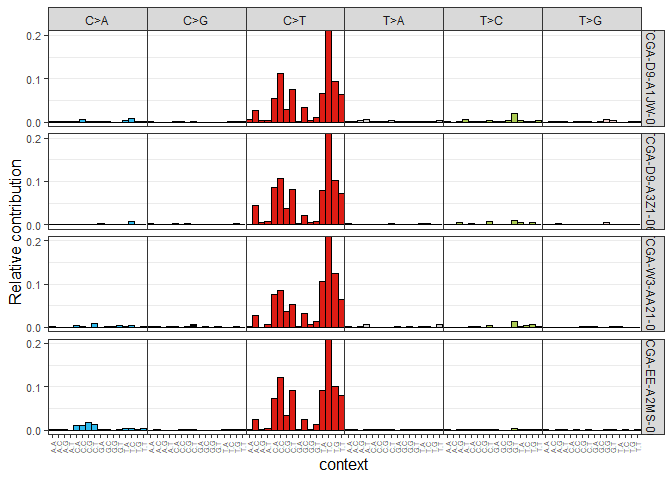

``` r
# Generate mutational profiles (top 4 mutated samples and top 4 less mutated)
mutations_in_samples = colSums(mm_mela)
mutations_in_samples = sort(mutations_in_samples, decreasing = T)
samples_to_plot = names(mutations_in_samples)[1:4]
plot_96_profile(mm_mela[,samples_to_plot], condensed = T)
```

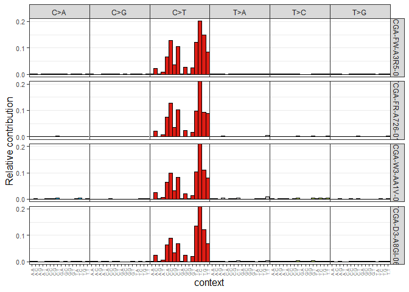

``` r
mutations_in_samples = sort(mutations_in_samples, decreasing = F)
samples_to_plot = names(mutations_in_samples)[1:4]
plot_96_profile(mm_mela[,samples_to_plot], condensed = T)
```

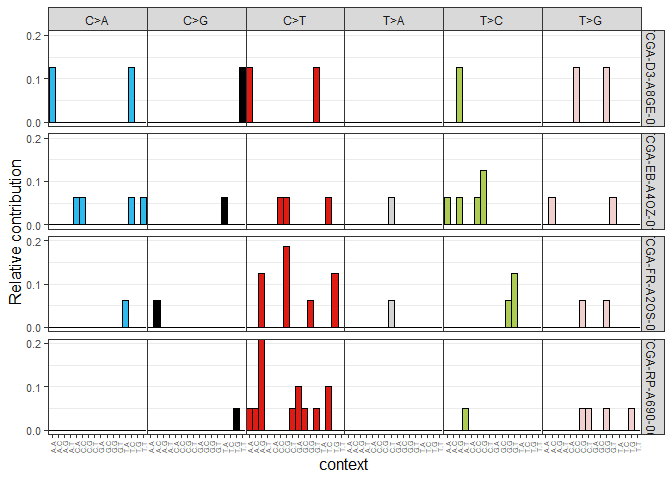

``` r
# Generate average mutational profiles
relative_mutational_profile = apply(mm_mela, 2, prop.table) # obtained relative
                                                            # mutational matrix
average_mutational_profile = rowMeans(relative_mutational_profile)
average_mutational_profile = data.frame(average_mutational_profile)
plot_96_profile(average_mutational_profile, condensed = T)
```

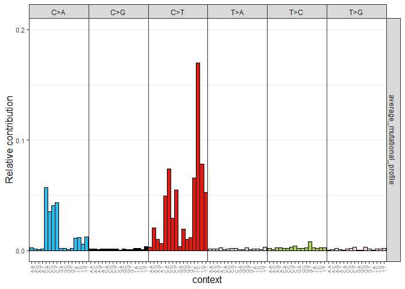

## Assigning reference mutational signatures

Leveraging the COSMIC mutational signatures, we will perform a
mutational signature assignment analysis to quantify the number of
mutations contributed by each signature to a given cancer sample and,
therefore, decipher which mutational processes have been active in each
individual tumor.

``` r
# Mutational signature assignment
cosmic_signatures = get_known_signatures(source = 'COSMIC_v3.2')
fit_res = fit_to_signatures(mm_mela, cosmic_signatures)

# Top contributing signatures
contributions = fit_res$contribution

top_contributing_signatures_abs = rowMeans(contributions)
top_contributing_signatures_abs = sort(top_contributing_signatures_abs,
                                       decreasing = T)[1:4]

## Top 4 contributing signatures (absolute values)
top_contributing_signatures_abs
```

        SBS7a     SBS7b     SBS38      SBS4 
    366.97614 340.91011 204.44450  99.49106 

``` r
relative_contributions = apply(contributions,2,prop.table)
top_contributing_signatures_rel = rowMeans(relative_contributions)
top_contributing_signatures_rel = sort(top_contributing_signatures_rel,
                                       decreasing = T)[1:4]

## Top 4 contributing signatures (relative values)
top_contributing_signatures_rel
```

         SBS7b      SBS7a      SBS38       SBS4 
    0.26336351 0.26019455 0.10885595 0.07240978 

``` r
# Mutational signature assignment strict
fit_res_strict = fit_to_signatures_strict(mm_mela, cosmic_signatures)
fit_res_strict = fit_res_strict$fit_res
contributions_strict = fit_res_strict$contribution
```

## Visualizing mutational signature assignment results

To visualize the mutational signature assignment results, we will use
the default visualizations available in the MutationalPatterns package.
However, other visualizations are also present as part of maftools
(please check the appropriate section in their vignette) or can be
created using ggplot2 and the contributions output matrix from the
mutational signature assignment analysis (contributions or
contributions_strict).

``` r
# Visualization of signature assignment results (fit_to_signatures)
set.seed(11111)
samples_to_plot = sample(1:ncol(mm_mela),4)

plot_contribution(contributions[,samples_to_plot], mode = "absolute")
```

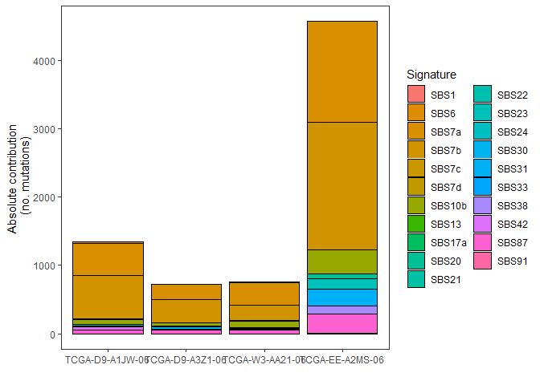

``` r
plot_contribution(contributions[,samples_to_plot], mode = "relative")
```

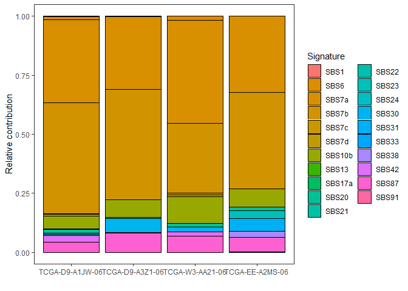

``` r
plot_contribution_heatmap(contributions, cluster_samples = F)
```

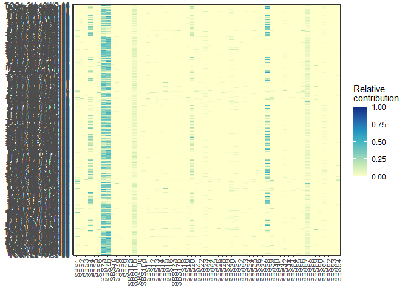

``` r
# Visualization of signature assignment results (strict)
plot_contribution(contributions_strict[,samples_to_plot], mode = "absolute")
```

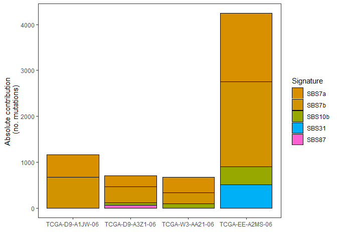

``` r
plot_contribution(contributions_strict[,samples_to_plot], mode = "relative")
```

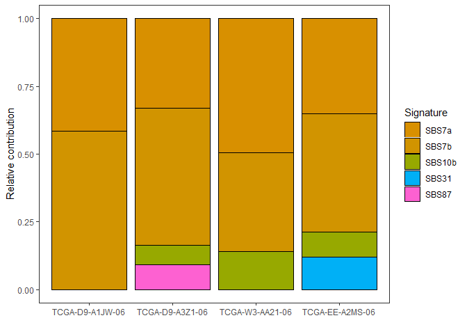

``` r
plot_contribution_heatmap(contributions_strict, cluster_samples = F)
```

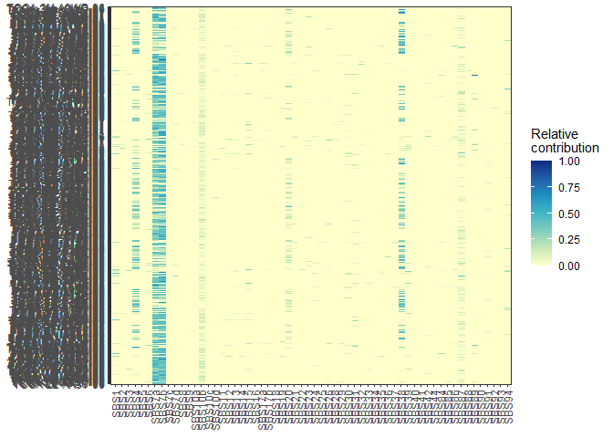

To check the cosine similarity of the reconstruction for some specific
samples, we can use the following visualization from the
MutationalPatterns R package.

``` r
# Cosine similarity reconstruction vs. original mutational profile (fit_to_signatures)
set.seed(11111)
samples_to_plot = sample(1:ncol(mm_mela),4)

plot_original_vs_reconstructed(mm_mela[,samples_to_plot],
                               fit_res$reconstructed[,samples_to_plot], 
                               y_intercept = 0.90)
```

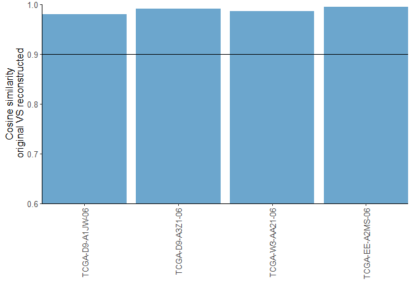

``` r
# Cosine similarity reconstruction vs. original mutational profile (strict)
plot_original_vs_reconstructed(mm_mela[,samples_to_plot],
                               fit_res_strict$reconstructed[,samples_to_plot], 
                               y_intercept = 0.90)
```

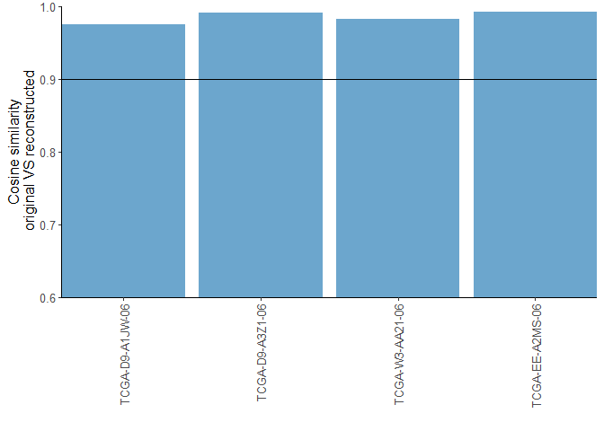

> Q. Which is the etiology of the top absolute contributing signature
> for liver cancer? Aristolochic acid exposure

> Q. Which is the most prominent mutational context for the top
> contributing signature in skin cancer? C\>T

> Q. The etiology of the top contributing signature for lung cancer
> corresponds to an endogenous cellular mechanism. False

> Q. SBS4 is one of the most common signatures found in lung cancer and
> is associated with tobacco smoking. True

> Q. SBS7d is one of the most common signatures in skin cancer and is
> associated with UV light exposure and high numbers of C\>T mutations
> False
